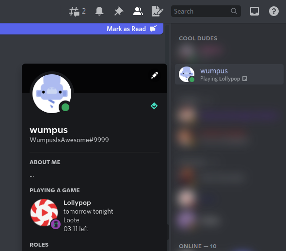
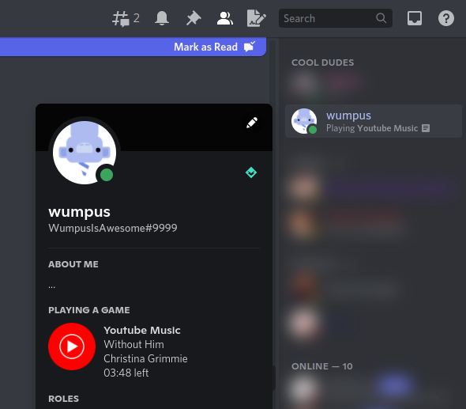
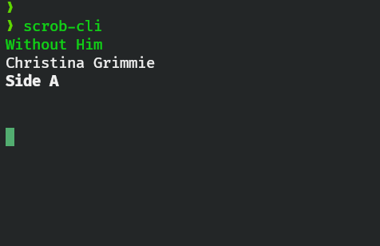

<p align="center">
    

<h2 align="center">🎶 Scrob</h2>

  <p align="center">
    Universal last.fm scrobbler 
    <br>
    <a href="https://github.com/srevinsaju/scrob/issues/new">Report bug</a>
    ·
    <a href="https://github.com/srevinsaju/scrob/issues/new">Request feature</a>
  </p>
</p>

<div align="center">

[](https://rust.org/)<br/><br/>


[](https://github.com/srevinsaju) [](https://github.com/srevinsaju/scrob/stargazers)

</div>


## Getting started 

Download a binary from the releases for your appropriate architecture 
and OS. Currently, only Windows and Linux are supported. 

```bash
scrob login
```
Login with your `last.fm` username and password.

## Usage 

To scrobble your songs to last.fm, just do
```bash
scrob
```

The tool will output the track name, artist and album name 
to stdout. By default, `scrob` scrobbles all songs it 
detects from the active player, and sets Discord Rich 
Presence. It is possible to disable either of this
using the `--no-discord` or `--no-scrobble` parameters. 
The latter is very useful when you need to debug scrob 
without having it to mess up your last.fm scrobbles. 


## Build
`scrob` is built on Rust, and uses `cargo`.

```bash
cargo build
target/debug/scrob --help
```

  



## License 
[This repository](https://github.com/srevinsaju/scrob) is licensed
under the MIT license. For more information, see [LICENSE](./LICENSE).


